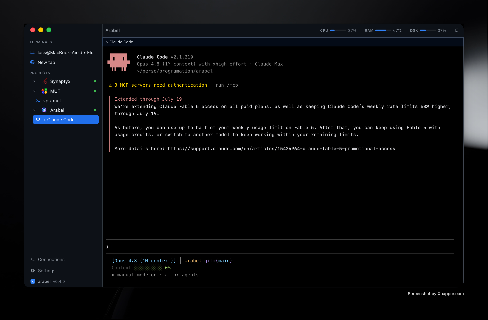

<div align="center">


# Arabel

**A desktop terminal with vertical tabs, built for working with AI coding agents.**

[](#licence)




</div>

## Why

I was tired of Termius and friends. I wanted vertical tabs, and I wanted a
terminal that actually knows when an agent is working, waiting on me, or done.

There are probably other tools that do some of this — honestly, I didn't go
looking. I built the one that answered my own needs. It stays small on purpose:
a terminal, a sidebar, and the handful of things you actually reach for.

## Features

| | |
|---|---|
| **Remotes** | Add, edit and reuse SSH identities across machines. Import from `~/.ssh/config` (with `Include` resolution) or from VS Code's Remote-SSH config. Per-remote working directory and per-remote flags: tmux, mosh, system-ssh, auto-launch the agent on connect. |
| **Four ways to connect** | Built-in SSH (russh: key, password, ssh-agent, known_hosts TOFU) · **system ssh** when you need real OpenSSH compatibility · **mosh** for flaky links · local shells and **WSL distros**. |
| **Vertical tabs & projects** | Group terminals into named, emoji-tagged projects. Each keeps its tabs and splits, restores on launch, re-attaches surviving tmux sessions, and can replay startup commands in every new pane. |
| **Agent-aware panes** | Working / waiting / done per pane, from Claude Code hooks *and* from reading the TUI directly (so it works with no hooks, even locally). Live activity ("Read src/x.ts", "thinking…"), notifications with sound and Dock badge, and you can answer the agent — ✓/✗ or a numbered choice — straight from the notification card. |
| **Context & usage** | Opt-in strip under the sidebar for whatever pane you're on — local or SSH: context burnt in that session, and how much of your 5-hour and weekly windows is left. Those numbers live nowhere but Claude Code's status line, so arabel becomes it (`~/.arabel/ctx.sh`), calls the status line you already had, and hands it back when you switch the setting off. |
| **Agent tooling** | One-click hook sync, agent teams, plugin provisioning, paste an image into a remote agent (Ctrl+V, via SFTP), and `arabel preview <port>` — the agent asks, a browser pane opens and the tunnel is created. |
| **tmux** | Persistent sessions with reconnection, plus native control mode (`tmux -CC`) mirroring tmux panes into the app grid. |
| **Git panel** | Over the remote, through the SSH channel: status, stage, diff viewer, commit, branch list and switch, log, fetch with ahead/behind, `pull --ff-only`, push. |
| **SFTP** | Browse, download, drag-and-drop upload. |
| **Port forwards & browser panes** | Preview your dev server inside the grid. |
| **Dictation** | Speak into any pane (⌘⇧M): the mic is read natively (cpal), and transcription runs through an OpenAI-compatible API (Groq, OpenAI, or a server of your own), or fully offline — Whisper (whisper.cpp) or **Parakeet TDT v3** (NVIDIA, via ONNX Runtime; 25 languages auto-detected, far quicker than Whisper large on CPU). The text is inserted, not sent — you read it first. |
| **Getting around** | Command palette (⌘P) over panes, projects and remotes · find in terminal (⌘F) · zoom a pane · drag panes between tabs and projects. |
| **Yours to tweak** | 18 rebindable actions, a theme editor (16-colour ANSI grid, 5 presets incl. OLED), font import from VS Code, live CPU/RAM/disk meters, and config sharing between machines (secrets excluded). |

## How it fits together

```
┌──────────────────────────────────────────────────┐
│  SvelteKit + xterm.js  (UI, panes, vertical tabs)│
├──────────────────────────────────────────────────┤
│  Tauri IPC                                       │
├──────────────────────────────────────────────────┤
│  Rust backend                                    │
│    ├─ SSH / SFTP / port forwards   (russh)       │
│    ├─ local PTY · system ssh · mosh · WSL        │
│    ├─ tmux control-mode                          │
│    └─ encrypted secrets vault                    │
└──────────────────────────────────────────────────┘
```

Secrets (key passphrases, passwords) live in a local ChaCha20-Poly1305 vault
rather than the OS keychain — a deliberate choice for an unsigned build, see
`store.rs`.

## Install

Grab a build from [Releases](https://github.com/DelityLuss/arabel/releases), or
build it yourself:

```sh
npm install
npm run tauri build
```

The default build embeds a local Whisper (whisper.cpp), so it needs **cmake and a
C++ toolchain** — Metal is switched on for macOS. Per platform:

| | |
|---|---|
| **macOS** | `brew install cmake` |
| **Windows** | See below — it needs the most setup. |
| **Linux** | `cmake`, `build-essential`, plus `libasound2-dev` for the microphone (needed even without local Whisper). |

### Building on Windows

```powershell
winget install Kitware.CMake LLVM.LLVM NASM.NASM
```

Then build from the **x64 Native Tools Command Prompt for VS 2022**, not a plain
PowerShell: several build scripts read `INCLUDE` / `LIB` / `VCINSTALLDIR`, and
outside that prompt they are unset and compiling even a trivial `.c` probe fails.
Visual Studio needs the *Desktop development with C++* workload.

What each piece is for:

- **LLVM** — `whisper-rs-sys` runs bindgen, which needs `libclang.dll`. If it
  isn't found, set `LIBCLANG_PATH` (Visual Studio also ships one at
  `…\VC\Tools\Llvm\x64\bin` when the *C++ Clang tools* component is installed).
  Do **not** reach for `WHISPER_DONT_GENERATE_BINDINGS=1` here: the bindings
  shipped with the crate are glibc ones, they do not match MSVC's libc and the
  build breaks further along. That variable is for Linux only.
- **NASM** — `aws-lc-sys`, pulled in by `russh` for SSH crypto, assembles with
  it on x86-64 Windows. `set AWS_LC_SYS_PREBUILT_NASM=1` works instead, using
  the object files shipped with the crate.

None of this is needed for `--no-default-features` except NASM, which SSH itself
depends on.

If you only want dictation through an API, drop whisper.cpp entirely — no cmake,
no C++ toolchain:

```sh
npm run tauri build -- --no-default-features
```

**Parakeet** is a separate, opt-in feature. It needs no C++ toolchain — `ort`
fetches prebuilt ONNX Runtime binaries during the build — but it does need
network access to that CDN, and it has never been through CI here:

```sh
npm run tauri build -- --features local-parakeet
```

## Development

```sh
npm run tauri dev     # the desktop app
npm run dev           # browser preview, fully mocked backend, no Tauri
npm run check         # typecheck
```

Recommended setup: [VS Code](https://code.visualstudio.com/) with the
[Svelte](https://marketplace.visualstudio.com/items?itemName=svelte.svelte-vscode),
[Tauri](https://marketplace.visualstudio.com/items?itemName=tauri-apps.tauri-vscode)
and [rust-analyzer](https://marketplace.visualstudio.com/items?itemName=rust-lang.rust-analyzer)
extensions.

## Contributing

This terminal is not perfect and I know it — it scratches my itch first. I'd be
genuinely happy to have people build it with me. Features, bug fixes, ideas: all
welcome. Open an issue to talk it over, or just send a PR. Run `npm run check`
before you do, and keep it simple — that's the whole point of the project.

Some known gaps, if you're looking for somewhere to start:

- **No ProxyJump / jump hosts.** Only reachable today by flipping a remote to the
  system-ssh transport. The `~/.ssh/config` importer ignores `ProxyJump`, so such
  a host imports silently broken.
- **No agent forwarding.**
- **SSH keepalive is hardcoded** (15s × 3), not configurable.
- The system-ssh and mosh transports **trade away SFTP, port forwards, metrics
  and tmux control mode** — reconciling that would be a nice win.
- The UI is one 5000-line `+page.svelte`. It works, but it's ripe for splitting.

## Licence

MIT.

Project emojis in `static/emoji/` come from the **NewsEmoji** pack on Telegram
([t.me/addemoji/NewsEmoji](https://t.me/addemoji/NewsEmoji)) and remain the
property of their authors. They are bundled here for personal use and are not
covered by this project's licence.
